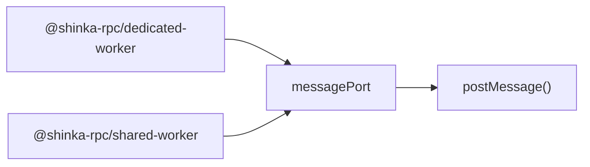
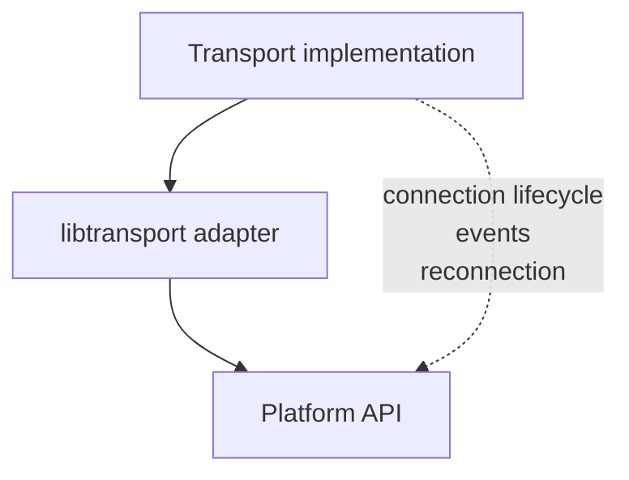

# libtransport

Small transport adapters for APIs that expose similar message-sending interfaces.

`@shinka-rpc/libtransport` is a collection of low-level helpers used to avoid
duplicating transport-specific glue code across Shinka RPC packages.

The package does **not** implement a transport layer by itself. Instead, it
provides small adapters that turn platform APIs into the functions expected by
Shinka transports.

## MessagePort

The `messagePort` adapter provides serialization-mode-specific send functions
for APIs compatible with
[`postMessage`](https://developer.mozilla.org/en-US/docs/Web/API/MessagePort/postMessage).

It is currently used by:

* `@shinka-rpc/dedicated-worker`
* `@shinka-rpc/shared-worker`

### Why an adapter?

Several browser APIs use essentially the same `postMessage` interface while
differing in their surrounding lifecycle and connection logic.

Rather than duplicating the message-sending implementation in every transport,
`@shinka-rpc/libtransport` keeps this part in one place.



The adapter only deals with **sending serialized data**. Connection management,
lifecycle, events, and other transport concerns remain the responsibility of
the package using it.

## Serialization modes

`messagePort` provides a sender for each supported `SerializationMode`.

### `text`

Sends a serialized string directly through `postMessage`.

```ts
const send = messagePort.text(port);

send(raw);
```

Equivalent to:

```ts
port.postMessage(raw);
```

### `binary`

Sends a `Uint8Array` and transfers its underlying `ArrayBuffer`.

```ts
const send = messagePort.binary(port);

send(raw);
```

Equivalent to:

```ts
port.postMessage(raw, [raw.buffer]);
```

The underlying buffer is transferred rather than copied. As with any
transferable object, the sender should therefore treat the transferred buffer
as no longer usable after the call.

## Supported API

The adapter only requires an object implementing the relevant part of
`postMessage`:

```ts
interface HasPostMessage {
  postMessage(message: any, transfer: Transferable[]): void;
  postMessage(
    message: any,
    options?: StructuredSerializeOptions
  ): void;
}
```

This deliberately avoids coupling the helper to a particular platform type such
as `MessagePort`. Any compatible object can be used.

## API

### `messagePort.text(port)`

Creates a function that sends text data using `postMessage`.

```ts
const send = messagePort.text(port);

send(raw);
```

### `messagePort.binary(port)`

Creates a function that sends binary data using `postMessage` with the
underlying `ArrayBuffer` in the transfer list.

```ts
const send = messagePort.binary(port);

send(raw);
```

## Design

`@shinka-rpc/libtransport` follows a deliberately small scope:



The adapter handles only the part that is common and repetitive. The actual
transport implementation remains responsible for everything else.

This makes the helpers reusable without forcing different transports to share
the same connection model or lifecycle.
