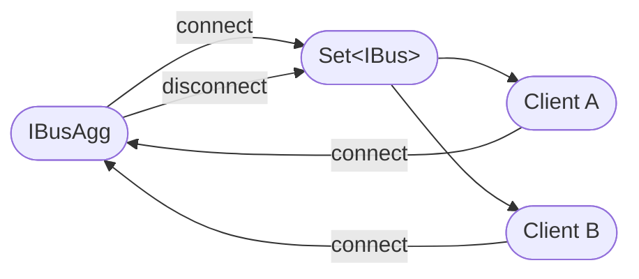
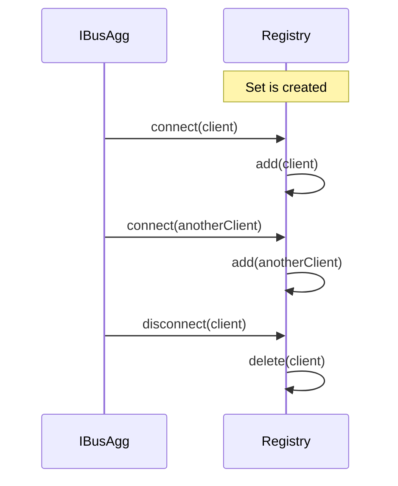

# `clientRegistry`

Creates a live registry of buses currently connected to an `IBusAgg`.

```ts
import { clientRegistry } from "@shinka-rpc/scenarios";

const clients = clientRegistry(aggregator);
```

The returned `Set` is automatically kept in sync with the aggregator:

* a bus is added when the aggregator emits `"connect"`;
* a bus is removed when the aggregator emits `"disconnect"`.



## API

```ts
function clientRegistry<SO, TO>(
  aggregator: IBusAgg<SO, TO>
): Set<IBus<any, any>>;
```

### Parameters

#### `aggregator`

The `IBusAgg` whose connection lifecycle should be observed.

### Returns

A `Set` containing the buses currently connected to the aggregator.

The returned set is **live**: it should be treated as a registry rather than a
snapshot. Its contents change automatically as buses connect and disconnect.

```ts
const clients = clientRegistry(aggregator);

console.log(clients.size);

for (const client of clients) {
  // Currently connected client
}
```

The set itself is not replaced when the registry changes. Existing references
therefore remain valid:

```ts
const clients = clientRegistry(aggregator);

function broadcast(data: unknown) {
  for (const client of clients) {
    client.dataEvent("update", data);
  }
}
```

As clients connect and disconnect, `broadcast` automatically operates on the
current set of connected clients.

## Lifecycle

`clientRegistry` subscribes to the aggregator's `"connect"` and `"disconnect"`
events when called.



The registry does not perform an initial enumeration of clients. It reflects
buses observed through the aggregator's connection events after the registry is
created.

## Example: broadcasting to connected clients

A common use case is broadcasting an event to every currently connected client:

```ts
const clients = clientRegistry(aggregator);

function broadcastUpdate(update: Update) {
  for (const client of clients) {
    client.dataEvent("update", update);
  }
}
```

No explicit client bookkeeping is required. Connection and disconnection are
handled by the registry.

## Important

The returned `Set` is intentionally exposed directly. This makes the registry
useful as a normal JavaScript collection:

```ts
clients.size;
clients.has(client);
clients.forEach(...);
for (const client of clients) {
  // ...
}
```

However, callers can also mutate the set manually. Such mutations are not
reflected back to the aggregator and may be overwritten by subsequent connection
lifecycle events. The intended usage is therefore to
**read and iterate the set**, while allowing the scenario to manage its
contents.
