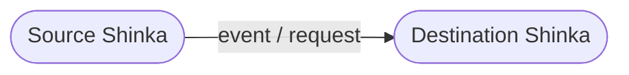
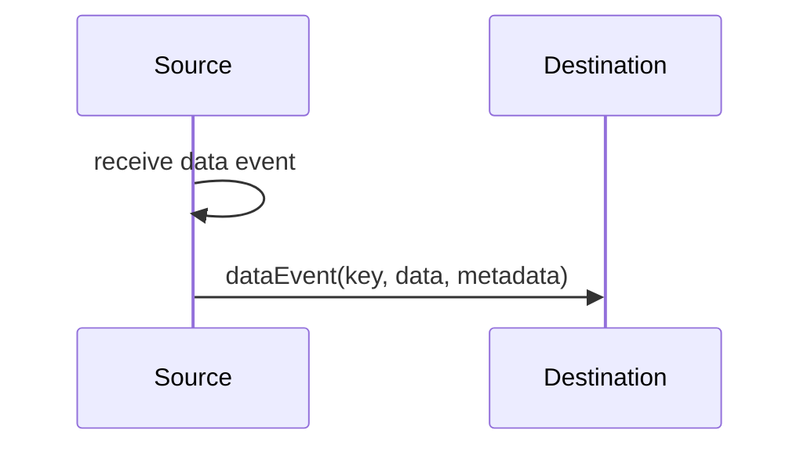
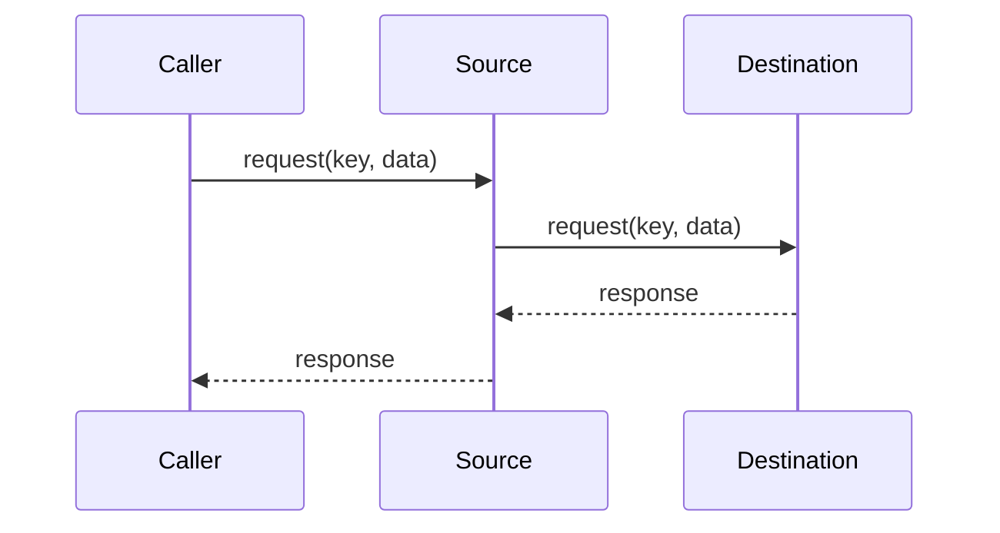
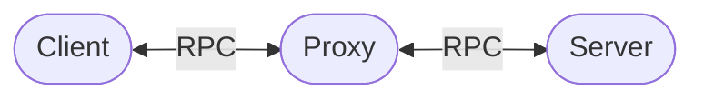

# Pass-through

A pass-through connects a source `Shinka` to a destination `Shinka` without
changing the data itself.



This is useful when one communication endpoint acts as an intermediary, proxy,
or bridge for another endpoint.

## Data events

`passThroughEvent` forwards a single data event:

```ts
passThroughEvent(source, dest, metadata, "state");
```

Conceptually, it creates the following forwarding path:



The event data is forwarded unchanged.

For multiple event keys, use `passThroughEvents`:

```ts
passThroughEvents(source, dest, metadata, [
  "state",
  "selection",
  "status",
]);
```

This is equivalent to registering `passThroughEvent` for each key.

## Requests

`passThroughRequest` forwards a single request to another `Shinka` and returns
its result to the original caller:

```ts
passThroughRequest(source, dest, metadata, "getState");
```

The resulting flow is:



The request data is passed to the destination unchanged, and the destination's
result becomes the result of the original request.

For multiple request keys, use `passThroughRequests`:

```ts
passThroughRequests(source, dest, metadata, [
  "getState",
  "getConfig",
]);
```

## Metadata

Both pass-through scenarios accept optional `ShinkaMeta`:

```ts
passThroughEvent(source, dest, metadata, "state");

passThroughRequest(source, dest, metadata, "getState");
```

The metadata is applied to the forwarded operation.

For requests, the helper additionally marks the handler as asynchronous with:

```ts
{
  hint: "AsyncFunction",
}
```

This reflects the fact that the forwarding handler awaits the destination
request before returning its result.

## API

### `passThroughEvent`

```ts
function passThroughEvent<SO, TO>(
  source: SourceBus<SO, TO>,
  dest: DestinationBus<SO, TO>,
  metadata: ShinkaMeta<SO, TO> | undefined,
  key: DataEventKey,
): void;
```

Registers a data-event handler on `source` that forwards events with `key` to
`dest`.

### `passThroughEvents`

```ts
function passThroughEvents<SO, TO>(
  source: SourceBus<SO, TO>,
  dest: DestinationBus<SO, TO>,
  metadata: ShinkaMeta<SO, TO> | undefined,
  keys: DataEventKey[],
): void;
```

Registers pass-through handlers for multiple data-event keys.

### `passThroughRequest`

```ts
function passThroughRequest<SO, TO>(
  source: SourceBus<SO, TO>,
  dest: DestinationBus<SO, TO>,
  metadata: ShinkaMeta<SO, TO> | undefined,
  key: DataEventKey,
): void;
```

Registers a request handler on `source` that forwards requests with `key` to
`dest`.

### `passThroughRequests`

```ts
function passThroughRequests<SO, TO>(
  source: SourceBus<SO, TO>,
  dest: DestinationBus<SO, TO>,
  metadata: ShinkaMeta<SO, TO> | undefined,
  keys: DataEventKey[],
): void;
```

Registers pass-through handlers for multiple request keys.

## Example

A common use case is placing an intermediary between two communication layers.



The proxy can forward selected operations without implementing their application
logic itself:

```ts
passThroughRequests(
  clientSide,
  serverSide,
  undefined,
  ["getState", "getConfig"],
);

passThroughEvents(
  serverSide,
  clientSide,
  undefined,
  ["stateChanged", "statusChanged"],
);
```

The proxy therefore becomes a routing layer rather than another implementation
of the underlying API.

## Design

The helpers deliberately operate at the `Shinka` level rather than introducing
another transport or protocol abstraction.

They can therefore be combined with the rest of `@shinka-rpc/core`:

* `Bus` provides the communication endpoint.
* `Shinka` provides the request and data-event interface.
* `@shinka-rpc/scenarios` provides reusable patterns for composing those
interfaces.

The package is intentionally small: each helper corresponds to a straightforward
communication scenario that can otherwise require repetitive handler
registration code.
