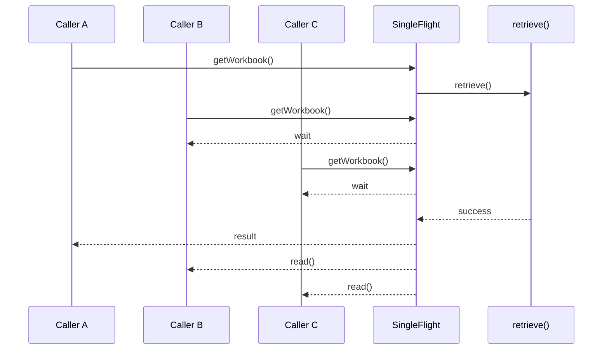
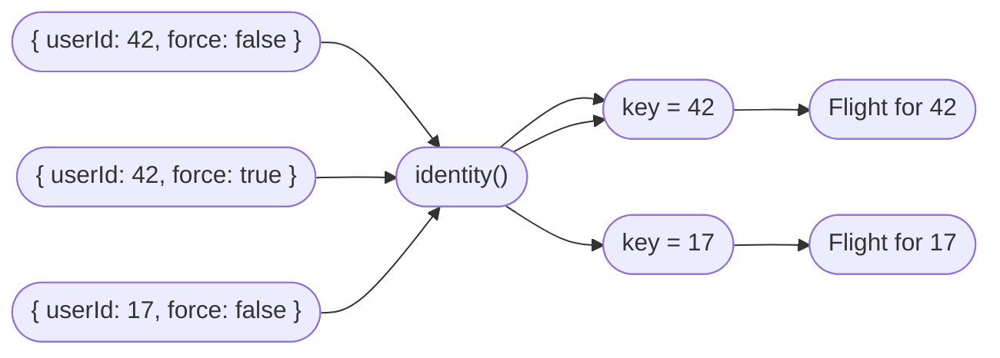
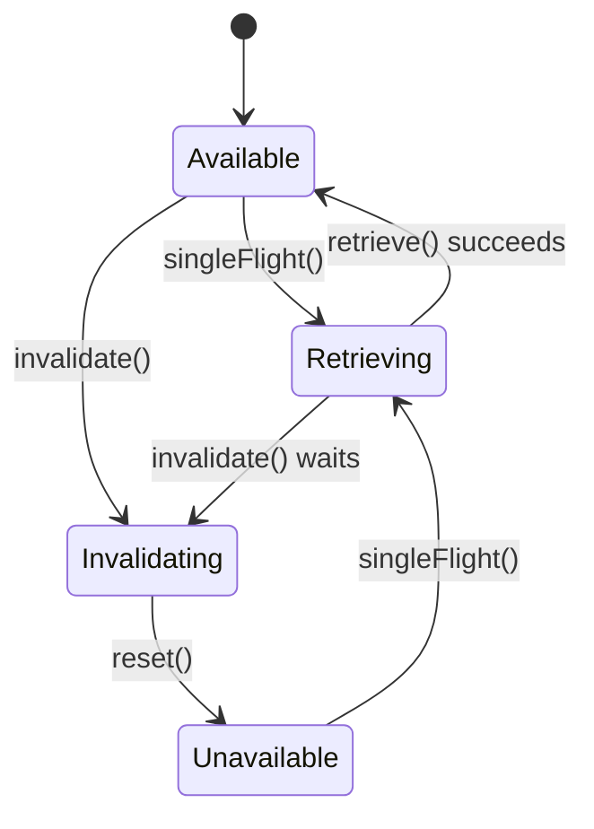
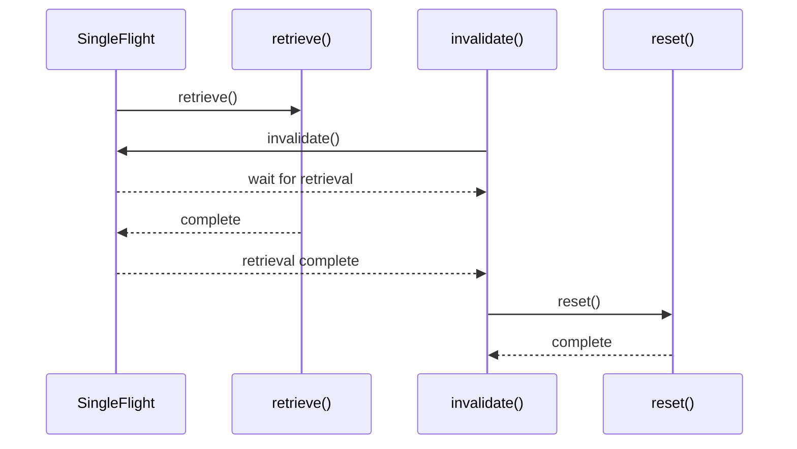
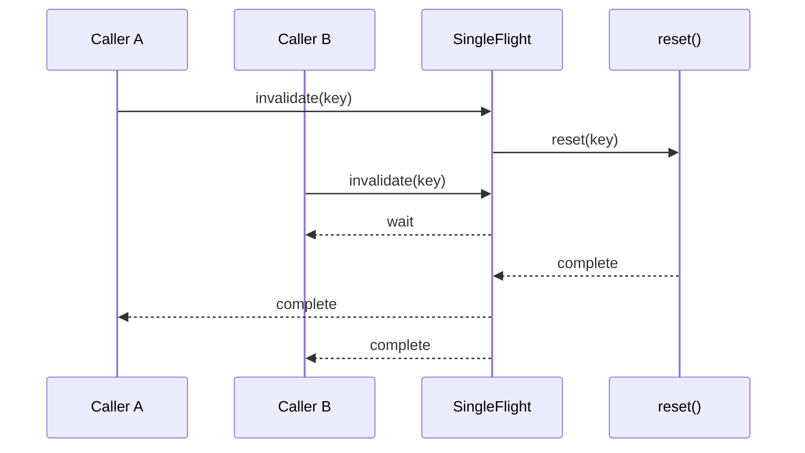
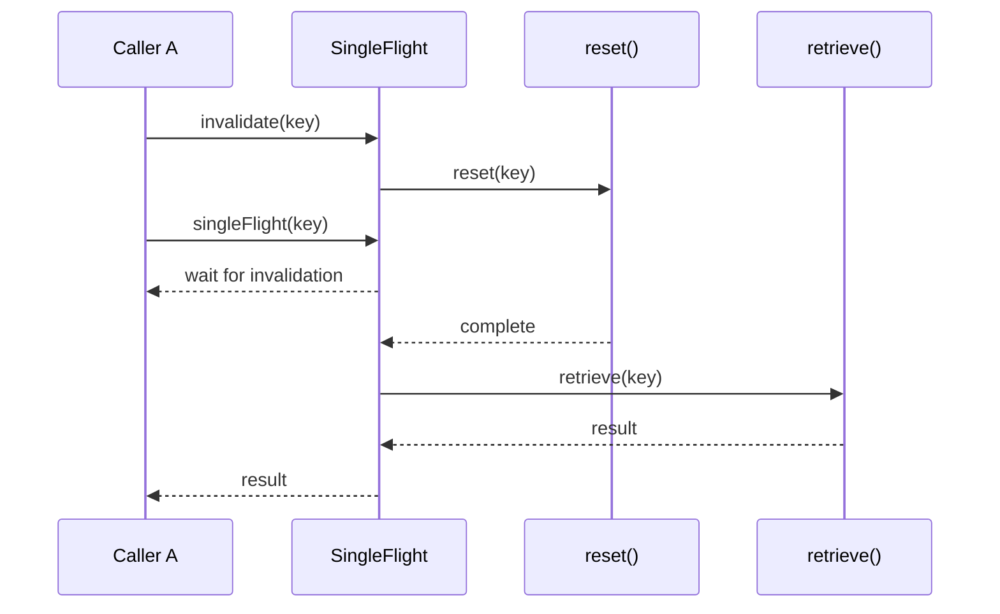
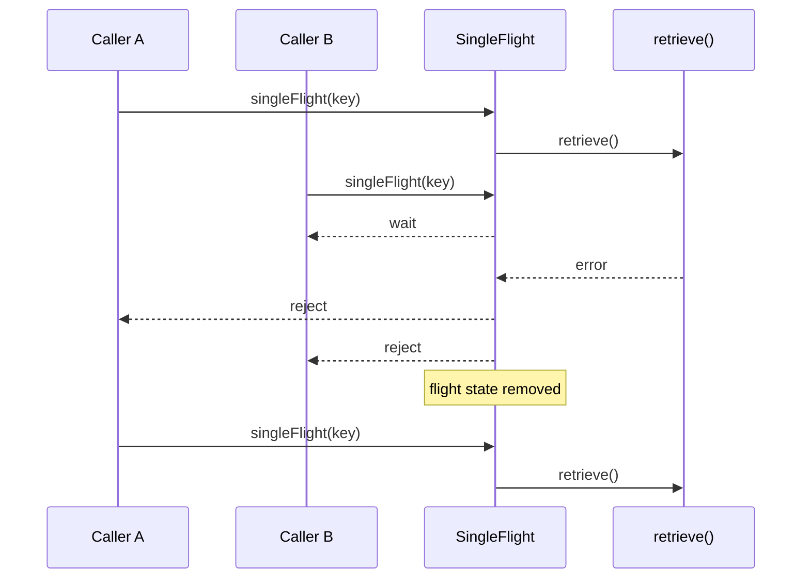

# `createSingleFlight`

`createSingleFlight` is a high-level synchronization primitive for coordinating
asynchronous resource acquisition and invalidation.

It prevents concurrent callers from performing the same acquisition more than
once. Calls are grouped by an **identity key**: callers referring to the same
key share one in-progress acquisition, while different keys are handled
independently.

The primitive is useful for resources such as:

* lazily loaded data;
* cached or remotely fetched state;
* authenticated connections;
* WebSocket connections;
* asynchronously initialized clients;
* resources whose validity can expire or be explicitly invalidated.

## Basic usage

```ts
import { createSingleFlight } from "@shinka-rpc/scenarios";

let workbook: ServerWorkbook | null = null;

const { 0: getWorkBook } = createSingleFlight({
  read: () => workbook!.state,
  reset: () => (workbook = null),
  retrieve: async () => {
    await wsConnecting;
    const data = await wsClient.request<WorkbookState>("get-data", 0);
    workbook = new ServerWorkbook(data);
    return data;
  },
});

server.onRequest("get-data", getWorkbook);
```

If several callers request the resource while it is unavailable, only one caller
executes `retrieve()`. The other callers wait for the same acquisition.



This is the fundamental property of a single-flight operation:

> **Many concurrent callers can share one asynchronous acquisition.**

## API

```ts
type IdentityKey =
  | string
  | number
  | boolean
  | symbol
  | null
  | undefined
  | void;

type CreateSingleFlightProps<A, K extends IdentityKey, T> = {
  identity?: (arg: A) => K;
  retrieve: (arg: A, key: K) => Promise<T>;
  read: (arg: A, key: K) => T;
  reset: (arg: A, key: K) => void;
};

const createSingleFlight: <A, K extends IdentityKey, T>(
  props: CreateSingleFlightProps<A, K, T>
) => [
  singleFlight: (arg: A) => Promise<T>,
  invalidate: (arg: A) => Promise<void>,
];
```

### `arg`

The argument supplied to `singleFlight()` and `invalidate()`.

`createSingleFlight` deliberately accepts exactly one argument. If an operation
needs multiple values, pass them as an object or tuple:

```ts
singleFlight({
  userId,
  forceRefresh,
});
```

or:

```ts
singleFlight([userId, forceRefresh]);
```

This keeps the API and its type inference simple while allowing arbitrary
argument structures.

The argument is application data. Its meaning is entirely determined by the
callbacks supplied to `createSingleFlight`.

---

## Identity keys

Each invocation is associated with an identity key:

```ts
const key = identity(arg);
```

The key identifies the resource and the corresponding single-flight state.

Internally, the state is maintained using a `Map`:

```ts
stateMap.set(key, state);
```

Therefore, `IdentityKey` represents values suitable for use as keys in a `Map`,
rather than imposing any serialization requirement on the argument.

### Default identity

If `identity` is omitted, the argument itself is used as the key:

```ts
const [getUser] = createSingleFlight({
  retrieve: ...,
  read: ...,
  reset: ...,
});
```

Conceptually:

```ts
identity: (arg) => arg
```

This is convenient when the argument already uniquely identifies the resource.

### Custom identity

A custom identity function allows the argument to contain additional information
without making all of it part of the resource identity:

```ts
const [getUser] = createSingleFlight({
  identity: ({ userId }) => userId,
  retrieve: ({ userId }) => loadUser(userId),
  read: ({ userId }) => users.get(userId)!,
  reset: ({ userId }) => users.delete(userId),
});
```

Here, different arguments with the same `userId` share the same flight.



Different keys always have independent state.

---

# Resource lifecycle

A resource can be thought of as moving through three relevant states:



The diagram describes the resource lifecycle conceptually. Internally, retrieval
and invalidation are independently coordinated so that concurrent callers cannot
start conflicting operations for the same identity key.

## `retrieve`

```ts
retrieve: (arg, key) => Promise<T>
```

Asynchronously acquires or initializes the resource.

For a particular identity key, `retrieve()` is never executed concurrently more
than once.

If another caller arrives while retrieval is already in progress, it waits for
the existing operation.

A successful retrieval is expected to make the resource available for subsequent
calls.

The value returned by `retrieve()` is returned to the caller that started the
retrieval. Callers that joined an existing flight obtain their result through
`read()` after the flight completes.

This distinction allows `retrieve()` to update shared state:

```ts
retrieve: async (id) => {
  const value = await fetchValue(id);
  cache.set(id, value);
  return value;
},

read: (id) => cache.get(id)!,
```

## `read`

```ts
read: (arg, key) => T
```

Reads an already available resource.

`read()` is called when:

* the resource is already available; or
* a caller has waited for another caller's successful retrieval.

## `reset`

```ts
reset: (arg, key) => void
```

Invalidates the resource associated with the given key.

If retrieval is currently in progress, `invalidate()` waits for it to finish
before calling `reset()`.

After `reset()` completes, the existing flight state for the key is removed. A
subsequent `singleFlight()` call may therefore start a new retrieval.

`reset()` should normally be synchronous and non-throwing. Keep it as simple and
atomic as possible. If invalidating a resource involves changing multiple pieces
of application state, make sure the resource cannot be observed in a partially
reset state.

`createSingleFlight` cannot provide transactional guarantees for user-managed
state. If `reset()` throws or leaves application state partially modified,
recovery is the responsibility of the calling application.

---

# Invalidation

The second returned function invalidates a resource:

```ts
const [singleFlight, invalidate] = createSingleFlight(...);

await invalidate(arg);
```

Invalidation has two important properties.

### It waits for an active retrieval

If a retrieval is already running, invalidation does not cancel it:



This guarantees that `reset()` does not race with the active retrieval.

### Concurrent invalidations are coalesced

Multiple callers invalidating the same key share one invalidation operation:



An invalidation therefore behaves as a synchronization barrier for the
corresponding key.

---

# Calls during invalidation

A `singleFlight()` call arriving while invalidation is in progress does not read
the old resource.

It waits for invalidation to complete and then starts a new retrieval if the
resource is unavailable.



This prevents a caller from observing a resource that has already entered the
invalidation lifecycle.

---

# Errors

A failed retrieval completes the current flight with the same error.

Waiting callers observe that failure, and the failed flight is removed so that a
later call can attempt retrieval again.



`createSingleFlight` does not automatically retry failed retrievals. A
subsequent call starts a new retrieval.

---

# Composing flights

Multiple `createSingleFlight` instances can be composed.

A resource acquisition can depend on another flight, allowing asynchronous
resources to form a dependency graph.

For example, a WebSocket connection may depend on an asynchronously refreshed
authentication token:

```ts
const [getToken, invalidateToken] = createSingleFlight({
  retrieve: async () => {
    const response = await fetch("/auth/token");
    const token = await response.text();
    currentToken = token;
    return token;
  },
  read: () => currentToken!,
  reset: () => (currentToken = null),
});

const [getWebSocket, invalidateWebSocket] = createSingleFlight({
  retrieve: async () => {
    const token = await getToken();
    socket = await connectWebSocket(token);
    return socket;
  },

  read: () => socket!,

  reset: () => {
    socket?.close();
    socket = null;
  },
});
```

The resulting dependencies form independent flights:


Each flight independently coalesces concurrent calls for its own identity keys.

This means `createSingleFlight` can be used as a building block for larger
asynchronous dependency graphs rather than only for isolated resources.

---

# When to use `createSingleFlight`

`createSingleFlight` is a good fit when:

* a resource is expensive or undesirable to acquire multiple times concurrently;
* the resource is shared by multiple callers;
* acquisition is asynchronous;
* the resource can become unavailable or invalid;
* callers requesting the same resource should share an in-progress acquisition;
* invalidation must not race with an active acquisition.

It is **not** a mutex.

If the requirement is:

> Only one caller may execute this critical section at a time.

use a mutex or another mutual-exclusion primitive instead.

The requirement for `createSingleFlight` is different:

> If several callers need the same unavailable resource at the same time,
perform the acquisition once and let them share its completion.

---

# Summary

`createSingleFlight` provides three core guarantees for each identity key:

1. **One active retrieval** — concurrent callers share the same acquisition.
2. **Coordinated invalidation** — invalidation waits for active retrieval and
concurrent invalidations are coalesced.
3. **Independent identities** — different keys have independent retrieval and
invalidation state.

The caller controls how arguments are interpreted, how resources are identified,
and how resources are acquired, read, and reset. `createSingleFlight` only
coordinates the asynchronous lifecycle around those operations.
