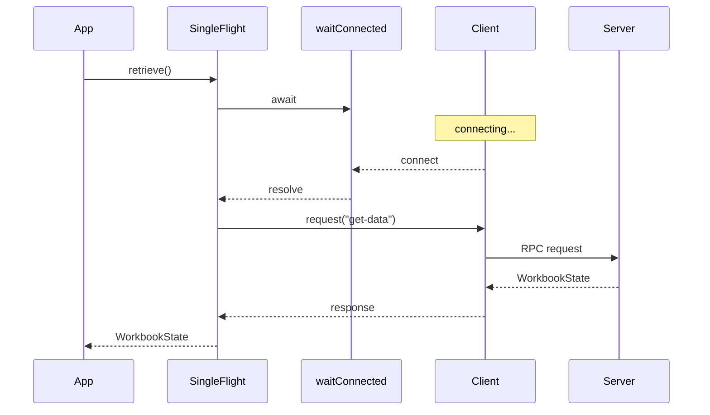
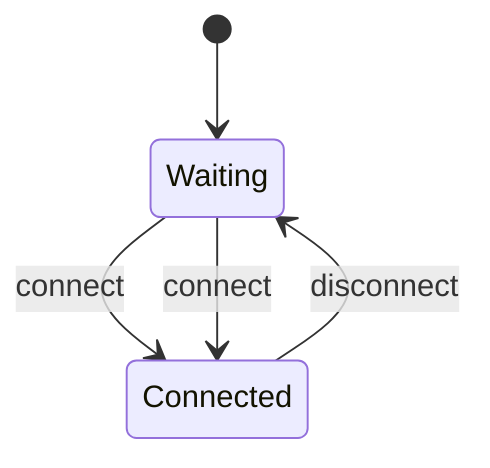
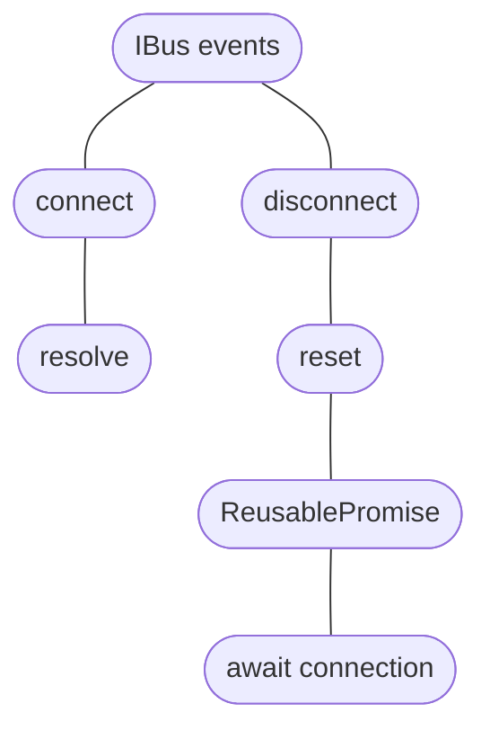

# `waitConnected`

`waitConnected` creates a reusable promise that represents the connection state
of an `IBus`.

```ts
import { waitConnected } from "@shinka-rpc/scenarios";

const connected = waitConnected(bus);

await connected;
```

The promise:

* resolves when the bus emits `connect`;
* becomes pending again when the bus emits `disconnect`;
* can therefore be awaited repeatedly across multiple connection cycles.

This makes it useful when an operation requires an active connection but should
not have to manage connection events itself.

## Example

A common use case is combining `waitConnected` with a `singleFlight` operation.

```ts
const wsClient = new Client({
  outscope,
  transport: wsClientTransport,
  serializer: wsSerializer,
  limon: limonOpportunistic(),
});

const wsConnecting = waitConnected(wsClient);

const { 0: getWorkBook } = createSingleFlight({
  read: () => workbook?.state,
  reset: () => (workbook = null),
  retrieve: async () => {
    await wsConnecting;
    const data = await wsClient.request<WorkbookState>("get-data", 0);
    workbook = new ServerWorkbook(data);
    return data;
  },
});
```

Here `waitConnected` separates **connection management** from **data retrieval**.

`singleFlight` is responsible for ensuring that only one retrieval is performed
at a time, while `waitConnected` ensures that the retrieval starts only after
the `Client` is connected.



## Reconnection

The returned promise is reusable rather than one-shot.

After the bus disconnects, the promise becomes pending again:



This is particularly useful for `Client` instances that can be restarted or
reconnect after a connection loss.

```ts
await wsConnecting;

// The client is connected here.

await wsClient.request("some-request");

// If the client disconnects and later reconnects:
await wsConnecting;

// The same promise can be awaited again.
```

## Why use `waitConnected`?

Without `waitConnected`, code that depends on a connection usually has to
explicitly coordinate connection events:

```ts
if (!isConnected) {
  await /* connection logic */;
}

await client.request(...);
```

`waitConnected` turns that state into a reusable synchronization primitive:

```ts
await connected;
await client.request(...);
```

The utility does not establish or maintain the connection itself. It only
exposes the `IBus` connection state as an awaitable value.

## API

### `waitConnected(bus)`

```ts
function waitConnected<SO, TO>(
  bus: IBus<SO, TO>
): ReusablePromise<void>;
```

Creates a reusable promise associated with the specified bus.

#### Parameters

| Parameter | Type           | Description                                               |
| --------- | -------------- | --------------------------------------------------------- |
| `bus`     | `IBus<SO, TO>` | Bus whose `connect` and `disconnect` events are observed. |

#### Returns

A `ReusablePromise<void>` that:

* resolves after `connect`;
* resets after `disconnect`;
* can be awaited across multiple connection cycles.

## Design

`@shinka-rpc/scenarios` is intentionally small.

The package is not intended to replace general-purpose concurrency primitives.
Instead, it provides **Shinka-RPC-specific compositions** of existing primitives
and events.

For example:



This keeps application code focused on the operation it wants to perform rather
than on the mechanics of observing the bus lifecycle.
