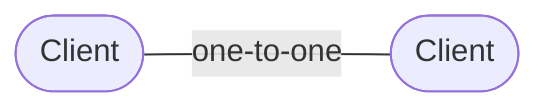
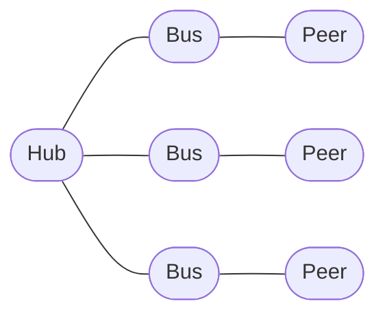

# Client

`Client` is a one-to-one communication endpoint in `@shinka-rpc/core`.

It represents a communication relationship between exactly two peers. The term
*client* does not imply a client/server role: both sides of a connection may be
represented by a `Client`.

For example, when communicating with a `DedicatedWorker`, both the page and the
worker can use `Client`:



For one-to-many communication, `@shinka-rpc/core` provides [`Hub`](#hub),
which manages a collection of [`Bus`](#bus) instances. A `Bus` represents an
individual connection, while `Client` provides the user-facing one-to-one
endpoint built on top of it.

## Installation

```bash
npm install @shinka-rpc/core
```

## Quick start

A `Client` requires an `OutScope` and a transport. Serialization, liveness
monitoring, and exclusive locking can be configured independently.

```ts
import { Client } from "@shinka-rpc/core";
import outscope from "@shinka-rpc/outscope/browser-page";
import { sharedWorkerClient } from "@shinka-rpc/shared-worker";
import serializer from "@shinka-rpc/serializer-msgspec";

const transport = sharedWorkerClient(
  () => new SharedWorker(new URL("./worker.ts", import.meta.url)),
);

export const client = new Client({ outscope, transport, serializer });

client.addEventListener("error", console.error);

client.start();
```

See [`@shinka-rpc/outscope`](../other/outscope.md) for `OutScope`.

See [Transport documentation](../transports/) for transports.

See [Serializer documentation](../serializers/) for serializers.

See [LiMon documentation](../limons/) for liveness monitoring.

See [Exclusive Lock documentation](../other/exclusive-lock.md) for exclusive locking.

## Requests

A request sends data to the remote peer and waits for its response.

```ts
type User = { /* ... */ };
const result = await client.request<User>("get-user", { id: 42 });
```

Requests are identified by a `key`. The payload can contain arbitrary
application data supported by the configured serializer.

The remote peer handles the request with `onRequest`:

```ts
client.onRequest("get-user", async (data) => {
  return await getUser(data.id);
});
```

The callback may return a value synchronously or asynchronously. Its result
becomes the response to the request.

### Registering request handlers

```ts
client.onRequest(key, callback, metadata?)
```

* `key` — application-defined request key.
* `callback` — function called when a matching request is received.
* `metadata` — optional transport and serialization metadata.

The callback receives the request data and the `Client` instance as its `thisArg`:

```ts
client.onRequest("get-user", async (data, client) => {
  return await getUser(data.id);
});
```

The `thisArg` is useful when a handler needs to access the client that received
the request.

## Data events

Data events provide one-way communication without waiting for a response.

```ts
client.dataEvent("status", { state: "ready" });
```

The remote peer can subscribe to the event:

```ts
client.onDataEvent("status", (data, client) => console.log(data));
```

Unlike requests, data events do not produce a response.

### Registering data event handlers

```ts
client.onDataEvent(key, callback)
```

* `key` — application-defined event key.
* `callback` — function called when a matching data event is received.

## Connection lifecycle

`Client` inherits its connection lifecycle from `Bus`.

### `start()`

Starts the client and initializes its communication stack.

```ts
await client.start();
```

Calling `start()` while the client is already started has no effect.

### `stop()`

Stops the client and releases its connection resources.

```ts
await client.stop();
```

### `restart()`

Stops and starts the client again.

```ts
await client.restart();
```

### `ping()`

Sends a ping request to the remote peer and returns the elapsed round-trip time
in milliseconds.

```ts
const latency = await client.ping();

console.log(`Latency: ${latency} ms`);
```

## Connection events

A client can subscribe to connection lifecycle events with `addEventListener()`.

```ts
client.addEventListener("connect", () => console.log("Connected"));
client.addEventListener("disconnect", () => console.log("Disconnected"));
client.addEventListener("error", (error) => console.error(error));
```

The supported event types are:

| Event        | Description                                                                         |
| ------------ | ----------------------------------------------------------------------------------- |
| `connect`    | The client has successfully started and is ready for communication.                 |
| `disconnect` | The client has stopped or its connection has terminated.                            |
| `error`      | An error occurred while starting, stopping, sending, receiving, or processing data. |

Listeners can be removed with `removeEventListener()`:

```ts
client.removeEventListener("error", onError);
```

Event listeners are invoked asynchronously.

## Exclusive lock

`Client` provides `exclusiveLock()` through its underlying communication bus.

See [Exclusive Lock documentation](../other/exclusive-lock.md) for details.

## Configuration

The constructor accepts the following options:

```ts
type BusProps<SO, TO> = {
  outscope: OutScope;
  transport: TransportSubscribe<SO, TO, any>;
  lock?: ExclusiveLock<SO, TO, any>;
  serializer?: SerializerRoot<SO, TO, any>;
  limon?: LiMon<SO, TO, any> | null;
  responseTimeout?: number;
};
```

### `outscope`

Defines the lifetime of the execution scope in which the client operates.

The client subscribes to the scope's termination and automatically stops when
the scope ends.

See [`@shinka-rpc/outscope`](../other/outscope.md).

### `transport`

Provides the underlying communication mechanism.

The transport is independent of the `Client` abstraction and can represent any
suitable communication channel.

See [Transport documentation](../transports/).

### `serializer`

Defines how messages are serialized and deserialized.

The default serializer is used when this option is omitted.

See [Serializer documentation](../serializers/).

### `limon`

Configures the optional Liveness Monitor.

The default value is `null`, meaning that no liveness monitor is used.

See [LiMon documentation](../limons/).

### `lock`

Configures the exclusive-lock implementation.

The default implementation is used when this option is omitted.

See [Exclusive Lock documentation](../other/exclusive-lock.md).

### `responseTimeout`

Specifies the timeout used for requests that require a response.

If omitted, the package default is used.

## Public API

### `request()`

Sends a request and waits for its response.

```ts
client.request<T>(key, data, metadata?)
```

Returns:

```ts
Promise<T>
```

### `dataEvent()`

Sends a one-way data event.

```ts
client.dataEvent(key, data, metadata?)
```

### `onRequest()`

Registers a request handler.

```ts
client.onRequest(key, callback, metadata?)
```

### `onDataEvent()`

Registers a data-event handler.

```ts
client.onDataEvent(key, callback)
```

### `start()`

Starts the client.

```ts
client.start(): Promise<void>
```

### `stop()`

Stops the client.

```ts
client.stop(): Promise<void>
```

### `restart()`

Restarts the client.

```ts
client.restart(): Promise<void>
```

### `ping()`

Measures the request round-trip time.

```ts
client.ping(): Promise<number>
```

### `addEventListener()`

Registers a lifecycle event listener.

```ts
client.addEventListener(type, listener)
```

### `removeEventListener()`

Removes a lifecycle event listener.

```ts
client.removeEventListener(type, listener)
```

### `exclusiveLock()`

Acquires an exclusive communication lock.

```ts
client.exclusiveLock(timeout)
```

See [Exclusive Lock documentation](../other/exclusive-lock.md).

### `extra`

An application-defined object for attaching additional data to the client.

```ts
client.extra.someValue = value;
```

`extra` is not interpreted by `@shinka-rpc/core`.

## Client vs. Bus vs. Hub

These types represent different communication relationships:

| Type     | Relationship   | Represents                     |
| -------- | -------------- | ------------------------------ |
| `Client` | one-to-one     | A communication endpoint       |
| `Bus`    | one connection | A connection between two peers |
| `Hub`    | one-to-many    | A collection of connections    |

A `Client` is a specialized user-facing form of `Bus` for one-to-one communication.

A `Hub`, on the other hand, does not represent a connection itself. It creates
and manages individual `Bus` instances:



This distinction is independent of the underlying transport and of which peer is
considered a "server" or "client" by the application.
