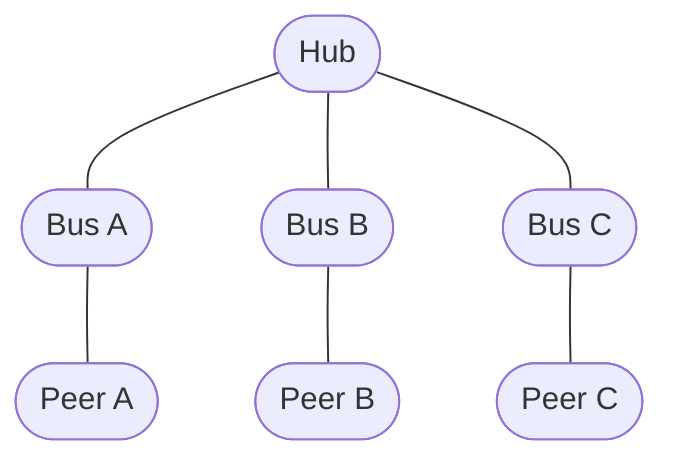
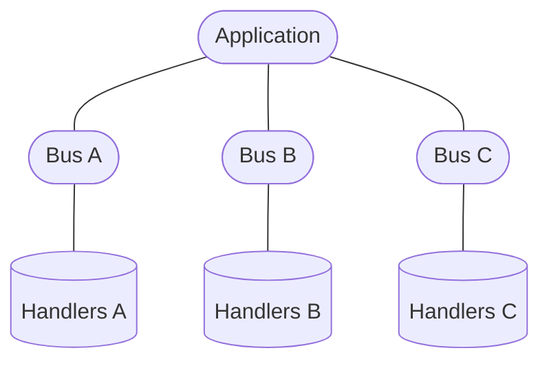
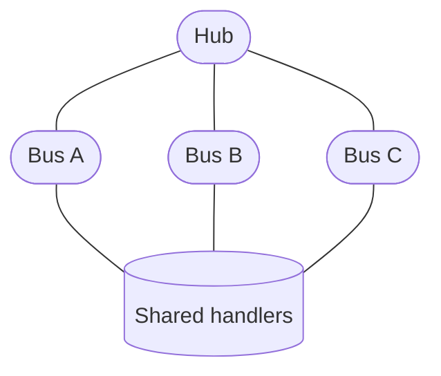
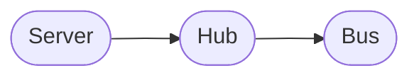
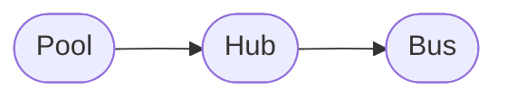

# `Hub`

`Hub` is a low-level container for multiple [`Bus`](./bus.md) instances.

A `Hub` does not represent a connection itself. Instead, it groups multiple
connections and provides shared request handlers, data-event handlers, event
listeners, and lifecycle management for all connections it owns.

It is primarily intended as a building block for higher-level abstractions such
as [`Server`](./server.md) and [`Pool`](./pool.md), or for advanced users
implementing their own connection manager.

## Connection model

A `Bus` represents exactly one connection:



The `Hub` does not replace these `Bus` instances. Each connection remains an
independent `Bus`.

::: tip This distinction is important:
`Bus` represents a connection. `Hub` represents a group of connections.
:::

## Shared handlers

A `Hub` provides a single set of request and data-event handlers shared by all
connections belonging to it.

Register a request handler with `onRequest()`:

```ts
hub.onRequest("user", async (data, bus) => {
  return await getUser(data.id);
});
```

The handler receives the `Bus` associated with the request as `thisArg`.

This allows the same handler to serve multiple connections while still providing
access to the connection that initiated the request.

For example:

```ts
hub.onRequest("user", async (data, bus) => {
  console.log("Request received from:", bus);

  return await getUser(data.id);
});
```

The handler registry is shared between all buses created by the hub.

### Data events

Data-event handlers are shared in the same way:

```ts
hub.onDataEvent("message", (data, bus) => {
  console.log("Message received:", data);
});
```

The `bus` argument identifies the connection that delivered the event.

This makes it possible to implement connection-independent application logic
while still allowing handlers to distinguish between individual peers when
necessary.

## Connecting a `Bus`

Use `connect()` to create a new connection owned by the hub.

```ts
const bus = await hub.connect({
  outscope,
  transport,
  serializer,
  lock,
});
```

Unlike a [`Client`](./client.md), the `Hub` does not define connection
configuration itself.

All properties required to construct the `Bus` are provided to `connect()`.

This allows every connection to have its own:

* execution scope;
* transport;
* serializer;
* liveness monitor;
* exclusive-lock implementation;
* response timeout;
* other connection-specific configuration.

The resulting `Bus` is automatically registered with the hub and started before
`connect()` resolves.

```ts
const bus = await hub.connect(props);

console.log(bus);
```

Once connected, the returned `Bus` can be used directly:

```ts
await bus.request("user", { id: 42 });

bus.dataEvent("notification", {
  message: "Hello",
});
```

## Connection ownership

A `Bus` created by `Hub.connect()` is owned by that hub.

The hub keeps track of all connected buses and automatically removes a bus from
its collection when the bus disconnects.

```ts
const bus = await hub.connect(props);

console.log(hub.size); // 1

await bus.stop();

console.log(hub.size); // 0
```

This also means that `Hub` does not require the caller to manually unregister
connections.

## Disposing the hub

Use `dispose()` to stop all connections currently owned by the hub:

```ts
await hub.dispose();
```

All active buses are stopped and the `dispose()` promise resolves after they
have finished stopping.

While disposal is in progress, new connections are not started until disposal
has completed.

This makes `dispose()` suitable for shutting down a whole group of connections
as a single lifecycle unit.

```ts
await hub.dispose();

console.log(hub.size); // 0
```

A hub can be reused after disposal:

```ts
await hub.dispose();

const bus = await hub.connect(props);
```

## Connection count

The `size` property returns the number of connections currently owned by the
hub.

```ts
console.log(hub.size);
```

The value changes automatically when buses are connected or disconnected.

## Disposal state

The `isDisposing` property indicates whether the hub is currently disposing its
connections.

```ts
if (hub.isDisposing) {
  // Hub is shutting down its connections
}
```

It becomes `true` while `dispose()` is in progress and returns to `false` when
disposal completes.

## Events

A `Hub` provides event listeners that are shared by all buses it owns.

```ts
hub.addEventListener("connect", (bus) => {
  console.log("Connection established", bus);
});

hub.addEventListener("disconnect", (bus) => {
  console.log("Connection closed", bus);
});

hub.addEventListener("error", (bus, error) => {
  console.error("Connection error", bus, error);
});
```

The listener receives the affected `Bus` as its first argument.

The same listener can therefore observe the lifecycle of every connection
managed by the hub.

Remove a listener with `removeEventListener()`:

```ts
hub.removeEventListener("disconnect", onDisconnect);
```

See the [`Bus` event documentation](./bus.md) for the available event types and
their semantics.

## `extra`

The `extra` property provides application-defined storage associated with the
hub:

```ts
hub.extra.someValue = value;
```

`@shinka-rpc/core` does not assign any semantics to its contents.

Unlike `Bus.extra`, which belongs to an individual connection, `Hub.extra`
belongs to the hub itself and can be used for state shared by the connection
manager.

## Hub and Bus

The distinction between the two is fundamental:

|                     | `Bus`             | `Hub`                       |
| ------------------- | ----------------- | --------------------------- |
| Represents          | One connection    | A group of connections      |
| Request handlers    | Connection-facing | Shared by all buses         |
| Data-event handlers | Connection-facing | Shared by all buses         |
| Event listeners     | One connection    | All owned connections       |
| Lifecycle           | One connection    | All owned connections       |
| `extra`             | Per connection    | Per hub                     |
| `size`              | —                 | Number of owned connections |

A `Hub` does not proxy or abstract away the `Bus` API. `connect()` returns the
actual `Bus` representing the newly created connection.

## Why `Hub` exists

Without a `Hub`, an application managing multiple connections would have to
duplicate connection-level configuration and handler registration:



A `Hub` allows those connections to share the same application-level handlers
and event listeners:



Each connection remains independent, while the logic responsible for handling
connections can be defined once.

## Typical use

`Hub` is particularly useful when implementing abstractions where multiple
independent connections belong to the same logical component.

For example, a connection manager can create buses dynamically:

```ts
const hub = new Hub();

hub.onRequest("meta", async () => {
  return await getMetadata();
});

const busA = await hub.connect({
  outscope,
  transport: transportA,
  serializer,
});

const busB = await hub.connect({
  outscope,
  transport: transportB,
  serializer,
});
```

Both connections now use the same request handlers, while each `Bus` retains
its own connection-specific configuration and state.

## Advanced API

`Hub` is intentionally a relatively low-level abstraction.

Most applications should use [`Client`](./client.md), [`Server`](./server.md),
or [`Pool`](./pool.md) instead of constructing a `Hub` directly.

`Hub` is useful when the application needs to define its own
connection-management semantics while retaining the common `@shinka-rpc/core`
primitives.

The library itself uses `Hub` as a building block:




In these abstractions, `Hub` is responsible for the common mechanics of owning
multiple connections, while the higher-level object defines how those
connections are created and used.
