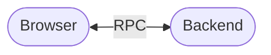
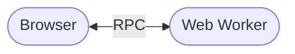
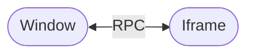
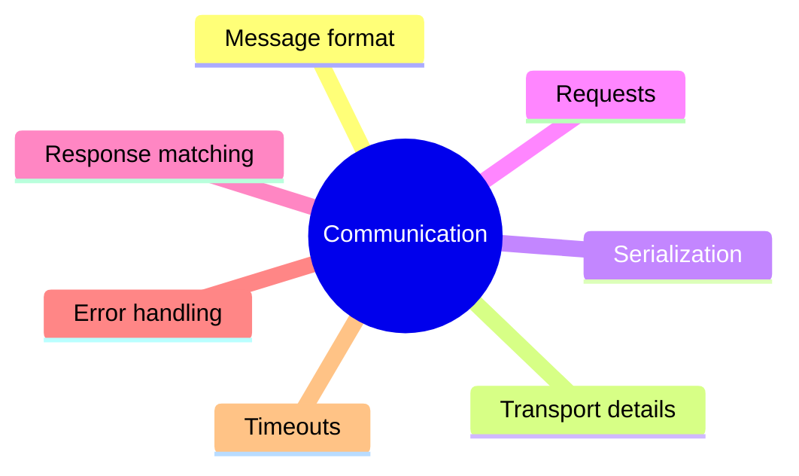

# What is RPC?

When two parts of an application need to communicate, the usual approach is to
exchange messages:

```ts
socket.send(
  JSON.stringify({
    type: "getUser",
    id: 42
  })
)
```

The receiving side then has to interpret the message, perform the requested
operation, and send a response back. As the application grows, you also need to
deal with request IDs, responses, errors, timeouts, serialization, connection
state, and other communication details.

RPC (Remote Procedure Call) provides a different way to model the same
interaction.

Instead of thinking in terms of messages, you can think in terms of
**calling a function that happens to run on another endpoint**:

```ts
const user = await api.getUser(42)
```

The operation may be executed remotely, but from the caller's perspective it
behaves much like an ordinary asynchronous function call.

The important part is that
**RPC does not imply a particular transport or a client/server architecture**.
The other endpoint may be a backend server, a Web Worker, another browser
context, or any other environment capable of communicating with the caller.

# What does `@shinka-rpc/core` do?

`@shinka-rpc/core` provides the communication primitives needed to build such
RPC systems.

It separates the different concerns involved in communication:

* **RPC communication** — requests, responses, errors, and events;
* **Transport** — how data is exchanged between endpoints;
* **Serialization** — how messages are represented as transferable data;
* **Connection lifecycle** — starting, stopping, and restarting communication;
* **Liveness monitoring** — detecting a connection that is no longer usable.

This separation allows the same RPC layer to work with different transports and
serialization formats without coupling the application to a particular
communication mechanism.

For example, the transport may be a WebSocket in one application and a
`MessagePort` in another, while the RPC layer remains conceptually the same.

# Communication, not just "client and server"

A key idea behind Shinka-RPC is that an RPC endpoint is not inherently a
**client** or a **server**.

The core abstraction is a communication **bus** representing a connection
between two endpoints. Both sides can participate in communication, and the same
underlying communication model can be used in different topologies.

This makes the library suitable for frontend applications where communication is
not necessarily limited to a browser-to-server connection:





The transport determines **how endpoints communicate**; RPC determines
**what that communication means**.

# Why use RPC?

Without an RPC layer, every application tends to develop its own communication
protocol:



RPC moves these concerns into reusable infrastructure, allowing application code
to focus on the operations being exposed rather than on the mechanics of
communication.

In other words, instead of building application logic around messages:

```ts
sendMessage(
    JSON.stringify({
    type: "getUser",
    requestId,
    payload: { id }
  })
)
```

you can build it around operations:

```ts
const user = await getUser(id)
```

`@shinka-rpc/core` is the foundation that makes this communication model
possible while keeping the underlying transport and other implementation details
replaceable.
