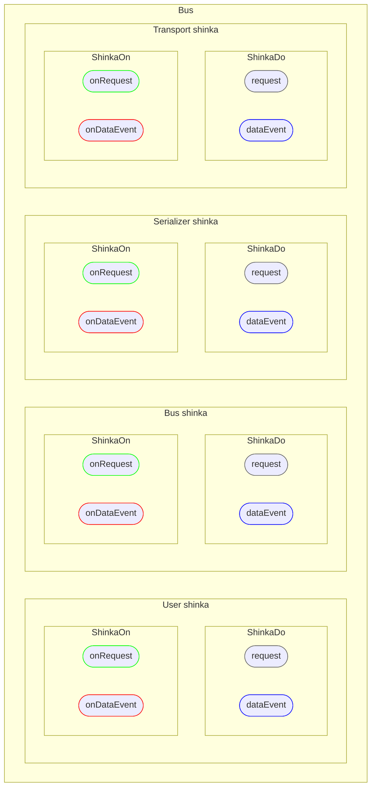

# Shinka

::: details What does `shinka` mean?
The name **Shinka** is a wordplay on the concept of a message **bus**.

In several Slavic languages, the term *bus* (as in *message bus* or *data bus*) is translated as **"shina"** (шина), literally meaning a data bus. **Shinka** (шинка) is the diminutive form of *shina*, which could be loosely translated as "little bus".

At the same time, *shinka* is also a word for a type of ham or cured meat in several languages, including Ukrainian, Belarusian, Polish, and even German (*Schinken*). The result is a deliberately playful name that references both messaging infrastructure and an unexpected culinary coincidence.
:::

# And where is this `shinka`?

Short answer: under `Bus` hood. And it's not single:



There are ***4*** independent `shinka`s under the bus hood: own for _transport_,
_serializer_, _bus_ and _user_. Your application defined `onRequest` /
`onDataEvent` handlers and `request` / `dataEvent` methods are just
`user shinka`

::: tip BUT
All 4 `shinka`s are handled by single connection. They are dispatched via
internal leading `MessageType` field
:::

::: details Literally:
```typescript
export const enum MessageType {
  // TRANSPORT
  TRANSPORT_REQUEST = 0,
  TRANSPORT_SUCCESS = 1,
  TRANSPORT_ERROR = 2,
  TRANSPORT_EVENT = 3,
  // SERIALIZER
  SERIALIZER_REQUEST = 4,
  SERIALIZER_SUCCESS = 5,
  SERIALIZER_ERROR = 6,
  SERIALIZER_EVENT = 7,
  // BUS
  BUS_REQUEST = 8,
  BUS_SUCCESS = 9,
  BUS_ERROR = 10,
  BUS_EVENT = 11,
  // USER
  USER_REQUEST = 12,
  USER_SUCCESS = 13,
  USER_ERROR = 14,
  USER_EVENT = 15,
}
```
:::

# So, what is `Shinka`?

It's independent communication channel:
- `ShinkaOn`: own `onRequest` and `onDataEvent` handler registries
- `ShinkaDo`: own `request` and `dataEvent` senders

# Why?

This allow building complex and powerful transports and serializers. For
example, serializer may ask interlocutor to change encryption key. One of them,
`bus shinka`, is used to handle `ping` request and 3 internal events
