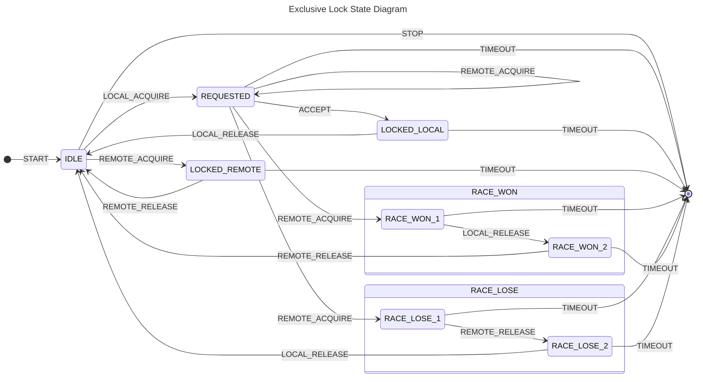

# Exclusive Lock

It's very powerful data channel management tool. In short words it allows to
ensure data channel is voided. 

```mermaid
---
title: Exclusive Lock State Diagram
---
stateDiagram-v2
    direction LR

    [*] --> IDLE: START

    IDLE --> REQUESTED: LOCAL_ACQUIRE
    IDLE --> LOCKED_REMOTE: REMOTE_ACQUIRE
    IDLE --> [*]: STOP

    REQUESTED --> LOCKED_LOCAL: ACCEPT
    REQUESTED --> RACE_WON_1: REMOTE_ACQUIRE
    REQUESTED --> RACE_LOSE_1: REMOTE_ACQUIRE
    REQUESTED --> REQUESTED: REMOTE_ACQUIRE
    REQUESTED --> [*]: TIMEOUT

    LOCKED_LOCAL --> IDLE: LOCAL_RELEASE
    LOCKED_LOCAL --> [*]: TIMEOUT

    LOCKED_REMOTE --> IDLE: REMOTE_RELEASE
    LOCKED_REMOTE --> [*]: TIMEOUT

    state RACE_WON {
        RACE_WON_1 --> RACE_WON_2: LOCAL_RELEASE
    }

    RACE_WON_1 --> [*]: TIMEOUT

    state RACE_LOSE {
        RACE_LOSE_1 --> RACE_LOSE_2: REMOTE_RELEASE
    }

    RACE_LOSE_1 --> [*]: TIMEOUT

    RACE_WON_2 --> IDLE: REMOTE_RELEASE
    RACE_WON_2 --> [*]: TIMEOUT

    RACE_LOSE_2 --> IDLE: LOCAL_RELEASE
    RACE_LOSE_2 --> [*]: TIMEOUT
```
