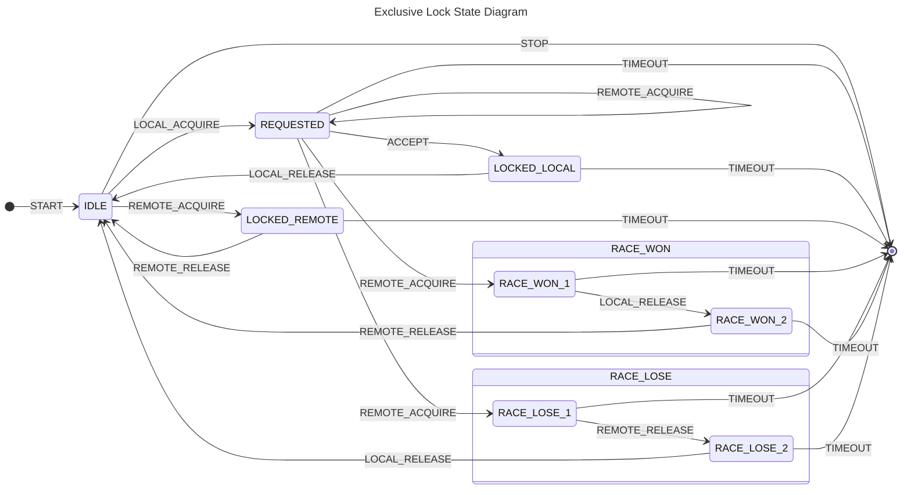

# Exclusive Lock

Optional exclusive channel synchronization for `@shinka-rpc/core`.

`@shinka-rpc/exclusive-lock` provides temporary exclusive ownership of the
transport channel between two peers.

While the lock is held:

- no messages produced by other components are written to the transport;
- outgoing messages are buffered in their original, unserialized form;
- the serializer does not observe buffered messages;
- buffered messages are automatically flushed when the lock is released.

This makes it possible to perform protocol-level operations that require a
completely clean communication channel.

The canonical example is encryption key rotation. Without exclusive ownership,
one side could switch to a new key while messages encrypted with the previous
key are still in flight.

Unlike an ordinary mutex, `exclusiveLock` coordinates two remote endpoints
connected by a transport such as WebSocket, SharedWorker, or any other
transport supported by `@shinka-rpc/core`.




## Why is it a separate package?

`exclusiveLock` is intentionally distributed as a standalone package instead
of being built into `@shinka-rpc/core`.

### Optional functionality

Not every application requires transport-level synchronization.

Keeping `exclusiveLock` separate reduces the default bundle size of
`@shinka-rpc/core` by approximately **5.6 kB** (**2.2 kB gzipped**).

Applications that need exclusive ownership can explicitly opt in.

### Testability

Synchronization logic can be tested independently from transports, serializers,
and the rest of the runtime.

### Customization

The package exposes `createExclusiveLock`, allowing applications to provide
a custom consensus strategy.

See `@shinka-rpc/consensus` for details.

---

## Installation

```ts
import { Server } from "@shinka-rpc/core";
import outscope from "@shinka-rpc/outscope/browser-page";
import { sharedWorkerServer } from "@shinka-rpc/shared-worker";
import { defaultExclusiveLock } from "@shinka-rpc/exclusive-lock";
import serializer from "@shinka-rpc/serializer-msgspec";

const server = new Server({
  outscope,
  transport: sharedWorkerServer,
  serializer,
  lock: defaultExclusiveLock,
});
```

`Server`, `Client`, and `Hub` accept an optional `lock` property.

If omitted, no exclusive synchronization is performed.

---

## Guarantees

Once an exclusive lock has been acquired:

- no messages from other components can be written to the transport;
- outgoing messages are buffered before serialization;
- buffered messages are delivered after the lock is released;
- both peers agree on the current lock owner.

These guarantees allow protocol state transitions to happen atomically on
both sides.

---

## Race conditions

Both peers may request the lock simultaneously.

Race resolution is delegated to `@shinka-rpc/consensus`.

The default implementation is exported as `defaultExclusiveLock`, but custom
strategies can be provided via `createExclusiveLock`.

---

## Custom configuration

```ts
import {
  createProtocol,
  defaultResolver,
  randInt32,
} from "@shinka-rpc/consensus";

import { createExclusiveLock } from "@shinka-rpc/exclusive-lock";

const lock = createExclusiveLock({
  protocol: createProtocol({
    randInt32,
    nonceLength: 8,
    resolver: defaultResolver,
  }),
});
```

The `protocol` object defines how race conditions are resolved when both peers
attempt to acquire the lock simultaneously.

See `@shinka-rpc/consensus` for details.

---

## Failure model

`exclusiveLock` assumes that an acquired lock must eventually be released.

A timeout is treated as a communication failure rather than a normal lock
expiration event.

If a timeout occurs, the connection is considered inconsistent and the
corresponding `Bus` is stopped.
