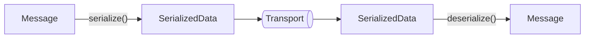
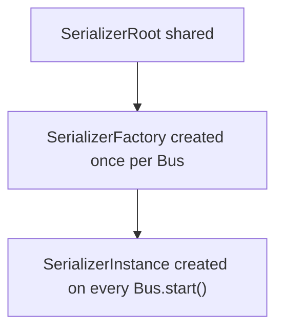
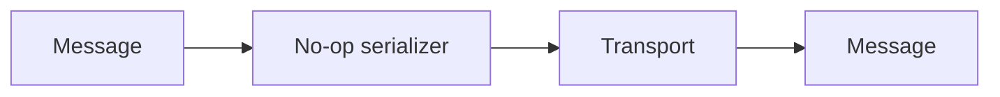
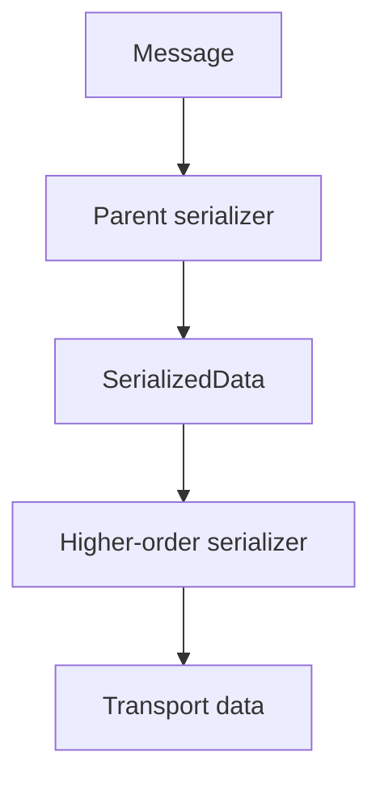

# Serializers

A serializer defines how messages are represented when they cross the transport
boundary.

Inside Shinka-RPC, messages use a compact internal representation: a `Message`
is an array containing the message type, request identifier, event key, and
message body. A serializer converts this internal representation into data
suitable for a transport and converts received data back into a `Message`.



Serialization is deliberately separated from transport. A transport does not
need to know how a message was encoded; it only needs to know how to handle the
resulting data.

A serializer may produce either textual or binary data. In some cases,
serialization is not required at all, and a serializer can operate in
`not-serialized` mode, passing `Message` objects directly to a transport.

## Serializer lifecycle

A serializer has three levels of lifetime:



The root is shared by all serializer instances created from the same serializer
configuration. This is particularly useful for aggregating components that
create multiple `Bus` instances: the root can register its handlers once and
reuse them for every instance.

The factory belongs to a particular `Bus` lifecycle. When the `Bus` starts, the
factory creates a serializer instance. When the `Bus` stops, that instance is
discarded. Starting the same `Bus` again creates a new serializer instance.

This separation allows a serializer to have both shared handlers and per-runtime
state.

## Serializer handlers

`SerializerRoot` receives a `ShinkaOn` object that is used to register handlers
for communication with the serializer on the opposite side.

Handlers are registered once at the root level:

```ts
export default ((shinkaOn) => {
  shinkaOn.onDataEvent("example-event", (data, thisArg) => {
    thisArg.shinka.dataEvent("another-event", "This is reply event");
  });

  shinkaOn.onRequest("show-statistics", (_, thisArg) => thisArg.state);

  return (thisArg, opts) => {
    // Create the runtime serializer instance.
  };
});
```

This is intentionally separate from the serializer instance. An instance may
contain mutable runtime state, while its handlers remain shared.

For example, a serializer can maintain statistics independently for every `Bus`:

```ts
type State = {
  serialized: number;
  deserialized: number;
};

export default ((shinkaOn) => {
  shinkaOn.onRequest("show-statistics", (_, thisArg) => thisArg.state);

  return (thisArg, opts) => {
    const { state } = thisArg;

    state.serialized = 0;
    state.deserialized = 0;

    return {
      serialize: (data) => {
        const serialized = JSON.stringify(data);
        state.serialized += serialized.length;
        return serialized;
      },

      deserialize: (data) => {
        state.deserialized += data.length;
        return JSON.parse(data);
      },

      transportInitOpts: {
        mode: "text",
        contentType: "application/json",
      },

      typeHints: {
        serialize: "Function",
        deserialize: "Function",
      },
    };
  };
}) satisfies SerializerRoot<any, any, State>;
```

Here, the request handler is installed once, while `state` is recreated for each
serializer instance.

## Serialization mode

A serializer communicates the representation of its output to the transport
through `transportInitOpts`.

There are three possible states:

| Mode             | Meaning                                                      |
| ---------------- | ------------------------------------------------------------ |
| `text`           | The serializer produces textual data.                        |
| `binary`         | The serializer produces binary data.                         |
| `not-serialized` | The original `Message` is passed to the transport unchanged. |

For serialized data, the serializer also provides a `contentType`:

```ts
type TransportInitOpts =
  | { mode: "text" | "binary"; contentType: string }
  | { mode: "not-serialized" };
```

The transport uses these options to configure itself appropriately. For example,
a WebSocket transport can switch between text and binary communication, while
worker-based transports can enable transferable binary data when necessary.

The serializer therefore describes not only how to encode a message, but also
the representation that the transport should expect.

## Synchronous and asynchronous serialization

Both serialization operations may independently be synchronous or asynchronous.

```ts
type SerializerFn<I, O, SO> =
  | ((data: I, opts?: SO) => O)
  | ((data: I, opts?: SO) => Promise<O>);

type DeserializerFn<I, O> =
  | ((data: O) => I)
  | ((data: O) => Promise<I>);
```

This means that all of the following combinations are valid:

| serialize | deserialize |
| --------- | ----------- |
| sync      | sync        |
| sync      | async       |
| async     | sync        |
| async     | async       |

Asynchronous serializers are useful when initialization or processing depends on
asynchronous facilities, such as external resources or asynchronous APIs. The
serializer abstraction does not require both directions to use the same
execution model.

## Serializer readiness

A serializer may require asynchronous initialization before it can be used.

For this purpose, a serializer instance may provide `onReady`:

```ts
type OnReadyFn = () => void | Promise<void>;
```

The `Bus` does not enter the `READY` state until `onReady` completes.

This allows a serializer to initialize resources such as workers, streams, WASM
modules, or other asynchronous runtime dependencies without exposing partially
initialized state to the rest of the system.

## Stopping a serializer

A serializer instance may provide a `stop` callback:

```ts
stop?: () => void;
```

It is called when the corresponding `Bus` instance is stopped and is intended
for releasing resources owned by that serializer instance.

Because serializer instances are recreated on every `Bus.start()`, resources
allocated by an instance should be released by its `stop` callback.

## Type hints

The serializer can explicitly declare whether its `serialize` and `deserialize`
functions are synchronous or asynchronous:

```ts
type SerializerTypeHints = {
  serialize: "Function" | "AsyncFunction";
  deserialize: "Function" | "AsyncFunction";
};
```

Shinka-RPC normally determines these values from
`Function.prototype.constructor.name`.

Explicit hints exist because some JavaScript environments do not reliably
report `"AsyncFunction"` for asynchronous functions. A serializer can therefore
provide explicit hints when automatic detection is unsuitable.

## Serializer initialization options

Serializer factories receive protocol initialization options:

```ts
type SerializerInitOpts = { root: "object" | "array" };
```

The `root` option describes the root representation expected by the serializer.
This allows serializers to adapt to protocols whose message representation
differs from the default representation used by Shinka-RPC.

This flexibility is primarily useful when adapting Shinka-RPC to compatible or
externally defined RPC protocols.

## Not-serialized mode

Serialization is not universally required. Some transports can carry `Message`
objects directly, so the default serializer is a no-op serializer operating in
`not-serialized` mode.



Whether `not-serialized` is valid depends on the transport and on any serializer
layered on top of another serializer.

For example, a compression serializer cannot operate directly on `Message`
values because compression requires serialized data. A higher-order serializer
such as `gzip` must therefore reject a parent serializer whose mode is
`not-serialized`.

## Higher-order serializers

A serializer can also be built on top of another serializer.

Conceptually:



For example, a compression serializer can delegate message encoding to another
serializer and then compress its output.

The higher-order serializer remains transparent to the transport: it exposes its
own `serialize`, `deserialize`, `transportInitOpts`, and `typeHints` while
composing the behavior of its parent serializer internally.

## Serializer API

The complete serializer abstraction consists of three layers:

```ts
type GenericSerializer<I, O, SO> = {
  serialize: SerializerFn<I, O, SO>;
  deserialize: DeserializerFn<I, O>;
  onReady?: () => void | Promise<void>;
  stop?: () => void;
  typeHints: SerializerTypeHints;
  transportInitOpts: TransportInitOpts;
};

type SerializerFactory<SO, TO, SS> = (
  thisArg: InternalHandlerThisArg<SO, TO, SS>,
  opts: SerializerInitOpts,
) =>
  | SerializerInstance<SO>
  | Promise<SerializerInstance<SO>>;

type SerializerRoot<SO, TO, SS> = (
  shinkaOn: ShinkaOn<SO, TO, InternalHandlerThisArg<SO, TO, SS>>,
) => SerializerFactory<SO, TO, SS>;
```

In practice, a serializer implementation usually follows this structure:

```ts
const serializer = ((shinkaOn) => {
  // Register shared handlers.

  return (thisArg, opts) => {
    // Initialize instance-specific state.

    return {
      serialize,
      deserialize,
      typeHints,
      transportInitOpts,
      onReady,
      stop,
    };
  };
}) satisfies SerializerRoot<any, any, any>;
```

The resulting abstraction is intentionally independent of any particular
encoding format. JSON, BSON, MessagePack, compression, custom binary protocols,
and pass-through transports can all be represented using the same serializer
contract.
