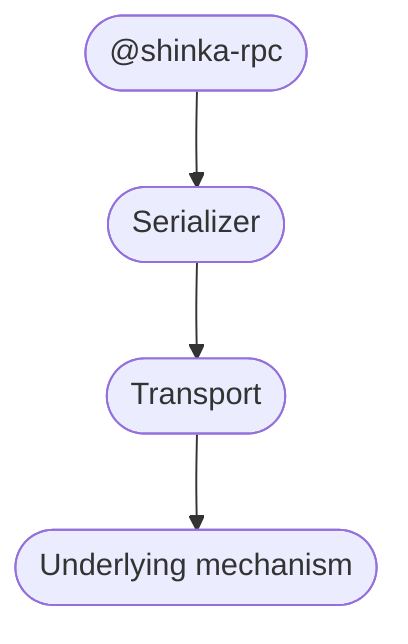
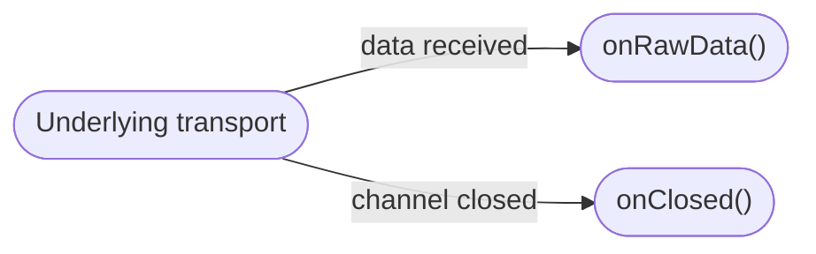
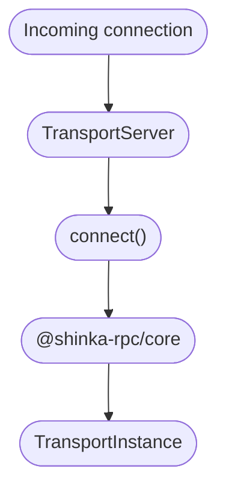

# Transports

A **Transport** is the communication layer used by `@shinka-rpc/core` to exchange serialized data between two peers.

The core does not depend on a particular communication mechanism. A transport can be implemented on top of WebSocket, `SharedWorker`, `DedicatedWorker`, browser extension messaging, or any other mechanism capable of providing the required operations.

In other words, a transport is an adapter between the RPC layer and an underlying communication mechanism:



The transport operates on serialized data and does not need to know what those data represent. RPC messages, control messages, or any other protocol details remain outside the transport's responsibility.

## Transport instance

A transport instance represents a single communication channel.

Its minimal interface is:

```ts
type TransportInstance<TO> = {
  send: (data: any, opts?: TO) => void;
  close: () => Promise<void>;
  onReady?: OnReadyFn;
  instruction: {
    hi?: boolean;
    bye?: boolean;
  };
};
```

### `send()`

Sends serialized data through the underlying communication mechanism.

The transport does not interpret the data. It is only responsible for delivering it to the other side.

### `close()`

Closes the communication channel.

The returned promise allows transports with asynchronous shutdown procedures to complete their cleanup.

### `onReady`

An optional callback used by transports whose connection becomes usable asynchronously.

A transport may therefore be created before the underlying communication channel is ready.

### `instruction`

Describes lifecycle properties of the underlying transport that cannot necessarily be observed by the peer directly.

```ts
instruction: {
  hi?: boolean;
  bye?: boolean;
}
```

Some communication mechanisms do not provide a reliable way for one side to observe when the other side connects or disappears.

For example, a `SharedWorker` may continue running after a page has been closed and may not receive a reliable event indicating that the page is gone. In such cases, the transport can instruct the core to explicitly communicate these lifecycle events to the peer.

`hi` indicates that the connection should explicitly announce its establishment to the peer.

`bye` indicates that the connection should explicitly announce its termination before closing.

This is different from detecting the underlying connection itself. The transport uses these instructions to tell the core **which lifecycle events cannot be reliably inferred from the underlying mechanism**.

A transport such as WebSocket may not need these instructions because connection establishment and closure are already observable through the underlying protocol.

## Transport factory

A `TransportFactory` creates transport instances and connects the underlying mechanism to the core:

```ts
type TransportFactory<SO, TO, TS> = (
  thisArg: InternalHandlerThisArg<SO, TO, TS>,
  onRawData: (data: SerializedData) => void,
  onClosed: () => void,
  opts: TransportInitOpts,
) => Promise<TransportInstance<TO>> | TransportInstance<TO>;
```

The factory receives callbacks for events originating from the underlying transport:

* `onRawData` — called when serialized data is received;
* `onClosed` — called when the underlying communication channel is closed.

The factory therefore acts as the boundary between the external communication mechanism and `@shinka-rpc/core`:



The factory itself may be synchronous or asynchronous.

A single factory can be used to create multiple independent transport instances.

## Client transports

A client transport is a transport that can be used to initiate a connection.

```ts
type TransportClient<SO, TO, TS> = TransportSubscribe<
  SO,
  TO,
  InternalHandlerThisArg<SO, TO, TS>
>;
```

A client transport produces a `TransportFactory`, which is then used by the core to create the communication channel.

The transport implementation is responsible for establishing the underlying connection. Once established, the resulting `TransportInstance` provides the common interface used by the core.

## Server transports

A server transport listens for incoming connections and provides them to the core:

```ts
type TransportServer<SO, TO, TS> = (
  shinkaOn: ShinkaOn<
    SO,
    TO,
    InternalHandlerThisArg<SO, TO, TS>
  >,
  connect: TransportConnectFn<SO, TO, TS>,
  eventListeners: ManageEventListenerPair<ServerEventType>,
) => void;
```

When the underlying mechanism detects a new peer, the server transport passes its `TransportFactory` to `connect()`.

Conceptually:



The server transport can also expose server lifecycle events:

* `connect`
* `predisconnect`
* `postdisconnect`

These events allow the transport implementation to integrate its own connection management with the core.

## Transport is a boundary, not a protocol

`@shinka-rpc/core` deliberately does not impose a particular transport protocol.

The transport is only expected to provide the primitives required by the core:

1. send serialized data;
2. receive serialized data;
3. close the communication channel;
4. report relevant connection lifecycle events;
5. explicitly announce lifecycle events when the underlying mechanism cannot expose them itself.

Everything above this boundary belongs to the core or to higher-level protocol components.

This makes the transport abstraction independent of the underlying communication technology.

The same core can therefore operate over a WebSocket, a worker messaging channel, browser extension messaging, or a completely different medium.

In principle, if an appropriate adapter can be implemented, almost anything can
be a transport — even something as unconventional as [RFC 1149](https://en.wikipedia.org/wiki/IP_over_Avian_Carriers).

The important part is not *how* the data travels. The important part is that the transport provides a reliable boundary through which `@shinka-rpc/core` can communicate with its peer.
