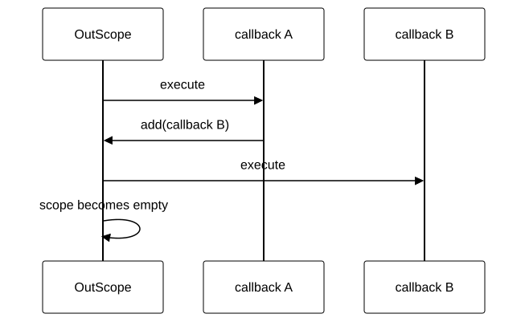

# @shinka-rpc/react

React integration for [`@shinka-rpc/core`](https://www.npmjs.com/package/@shinka-rpc/core).

The package currently provides a single integration point: `useOutScope`. It
connects the lifetime of a React component with the `OutScope` mechanism of
Shinka RPC.

This makes it possible to create and own a `Client` or another Shinka RPC
resource directly from a React component without making the component
responsible for manually tracking its cleanup.

## Installation

```bash
npm install @shinka-rpc/react
```

## `useOutScope`

```ts
useOutScope(
  callback: (outscope: OutScope) => void
): void;
```

`useOutScope` creates an `OutScope` whose lifetime is bound to the React
component.

The callback is executed once when the component is mounted and receives an
`OutScope` instance:

```ts
useOutScope((outscope) => {
  // initialize a resource
});
```

Resources can register their cleanup callbacks through the scope:

```ts
useOutScope((outscope) => {
  const resource = createResource();

  outscope.add(() => {
    resource.dispose();
  });
});
```

The registered callbacks are executed when the component's lifetime ends.

They are also executed when the page is about to be unloaded.

<!--  -->


### Example

A typical use case is a Shinka RPC `Client` whose lifetime should match the
component:

```tsx
import { useOutScope } from "@shinka-rpc/react";
import { Client } from "@shinka-rpc/core";

export default function App() {
  useOutScope((outscope) => {
    const client = new Client({
      outscope,
      transport,
      serializer,
    });

    client.start().catch(console.error);
  });

  // ...
}
```

The `Client` can then use the provided `OutScope` to register the cleanup
operations associated with its lifetime.

The React component does not need to know which resources the client owns or
how those resources should be released.

### Component lifetime

`useOutScope` is intentionally different from a normal dependency-based
`useEffect`.

The callback does not run again when props or state change:

```tsx
useOutScope((outscope) => {
  // runs once for this component lifetime
});
```

Consequently, values captured by the callback are the values available when the
scope is created.

If a resource needs to react to changing props or state, that lifecycle should
be managed separately.

## Cleanup semantics

`OutScope` is a cleanup registry.

<!--  -->


When cleanup starts, registered callbacks are drained until the scope is empty.

A callback may register another callback while cleanup is in progress. The newly
registered callback will also be processed:

<!--  -->


### Cleanup errors

An exception thrown by one cleanup callback must not prevent other callbacks
from running.

Each callback is therefore executed independently:

```ts
try {
  callback();
} catch (error) {
  console.trace(error);
}
```

Cleanup errors are reported with `console.trace`, while cleanup continues for
the remaining callbacks.

This is particularly important for an `OutScope`: failure to release one
resource should not prevent other resources owned by the same component from
being released.

## `add` and `remove`

The scope exposes two operations:

```ts
interface OutScope {
  add(listener: OutScopeEventListener): void;
  remove(listener: OutScopeEventListener): void;
}
```

`add` registers a cleanup callback:

```ts
useOutScope((outscope) => {
  outscope.add(() => {
    closeConnection();
  });
});
```

`remove` unregisters a previously registered callback:

```ts
useOutScope((outscope) => {
  const cleanup = () => {
    closeConnection();
  };

  outscope.add(cleanup);

  // Later, while the component is still alive:
  outscope.remove(cleanup);
});
```

A callback that has already been processed by cleanup cannot be processed again.

## React Strict Mode

React development mode may execute an effect's setup and cleanup cycle more than
once as part of its Strict Mode checks.

`useOutScope` uses `useOnce` internally to make the externally observable
lifetime of the scope independent of this additional development cycle.

In particular:

* the `useOutScope` callback is executed once;
* the actual cleanup callbacks are executed once;
* the development-only Strict Mode cleanup cycle does not prematurely destroy
the scope.

This allows code such as:

```tsx
useOutScope((outscope) => {
  const client = new Client({
    outscope,
    transport,
  });

  client.start().catch(console.error);
});
```

to have the same resource lifetime in development and production.

## `useOnce`

The package also exports the underlying `useOnce` hook:

```ts
useOnce(effect: React.EffectCallback): void;
```

It provides a `useEffect`-like hook with an empty dependency list while ensuring
that the supplied effect and its actual cleanup are executed only once per
component lifetime, including React development Strict Mode.

```tsx
useOnce(() => {
  const resource = createResource();

  return () => {
    resource.dispose();
  };
});
```

For most users, `useOutScope` is the more useful API. `useOnce` is exported
primarily as a small general-purpose utility for cases where the same lifetime
semantics are needed without an `OutScope`.

## Browser environment

`useOutScope` registers a global `beforeunload` listener. It is therefore
intended for browser-side React applications.

For frameworks supporting server rendering or React Server Components,
`useOutScope` should be used from a client component.

For example, in a React Server Components environment:

```tsx
"use client";

import { useOutScope } from "@shinka-rpc/react";

export function ClientComponent() {
  useOutScope((outscope) => {
    // browser-side resource
  });

  return null;
}
```

## Design

The package deliberately keeps the React integration small.

`@shinka-rpc/react` does not provide a React-specific RPC client, connection
state management, or a replacement for React state.

Instead, it provides an adapter between two independent lifecycles:

<!--  -->


The React component owns the lifetime.

`OutScope` provides the cleanup boundary.

`@shinka-rpc/core` remains responsible for the actual RPC resource and its
lifecycle.

This separation allows the same `Client` API to be used outside React while
keeping React-specific lifecycle management in a separate package.

## Complete example

The following example creates a Shinka RPC client when the component mounts and
associates its lifetime with the component:

```tsx
import { useMemo, useRef, useState } from "react";

import { Client } from "@shinka-rpc/core";
import { useOutScope } from "@shinka-rpc/react";

export default function Workbook() {
  const [connected, setConnected] = useState(false);
  const clientRef = useRef<Client | null>(null);

  useOutScope((outscope) => {
    const client = new Client({
      outscope,
      transport,
      serializer,
      responseTimeout: 15_000,
    });

    clientRef.current = client;

    client.addEventListener("connect", () => {
      setConnected(true);
    });

    client.addEventListener("disconnect", () => {
      setConnected(false);
    });

    client.addEventListener("error", (...args) => {
      console.error(args);
    });

    client.start().catch(console.error);
  });

  if (!connected) {
    return <div>Connecting...</div>;
  }

  return <WorkbookView client={clientRef.current!} />;
}
```

The important part is the ownership relationship:

<!--  -->


When the component's lifetime ends, the `OutScope` becomes the cleanup boundary
for the resources associated with the client.

## API

### `useOutScope`

```ts
function useOutScope(
  callback: (outscope: OutScope) => void
): void;
```

Creates an `OutScope` tied to the lifetime of the current React component.

**Parameters**

* `callback` — called once with the newly created `OutScope`.

**Cleanup**

Registered `OutScope` callbacks are executed when:

* the component is unmounted;
* the browser fires `beforeunload`.

Cleanup continues even when an individual callback throws.

### `useOnce`

```ts
function useOnce(effect: React.EffectCallback): void;
```

Runs a React effect once per component lifetime and ensures its actual cleanup
is also performed once, including under React development Strict Mode.
